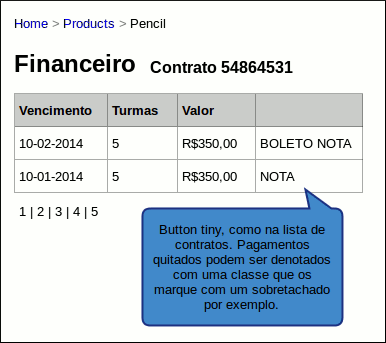

Gestão de contratos
===================

Contrato padrão
---------------

O contrato padrão consiste num plano anual dividido em 10 parcelas, sempre
entre fevereiro e novembro. O cliente inicia o pagamento na celebração do
contrato e paga as parcelas correspondentes ao período em que está utilizando.

Por exemplo, se aderir ao Mainiti em fevereiro, irá pagar entre fevereiro e
novembro. Já se aderir em abril, irá pagar entre abril e novembro.

.. note::

   Esta distribuição de pagamentos tem por objetivo diminuir as chances de
   inadimplências em dezembro e janeiro, quando as escolas naturalmente tem
   expediente limitado. Será mais fácil retomar um contrato em dia em fevereiro
   do que renegociar possíveis parcelas não pagas.

Custo por turma
"""""""""""""""

O custo é definido em variável de configuração (por exemplo 70 reais) porém,
será copiado para a turma cada vez que ela for ativada. Isto permitiria definir
turmas com valores diferenciados e/ou alterar o valor sem interferir em turmas
em andamento.

Acesso do gestor
----------------

Para um gestor de uma entidade realizar a administração financeira das turmas,
deverá acessar o painel inicial, onde tem a lista de contratos cadastrados, e
para cada contrato, clicar na ação *Financeiro*:

[Imagem da lista de contratos com o dropdown de ações aberto indicando o link
financeiro]

Ao clicar no link, terá acesso a uma lista de instâncias de pagamento, tanto
pendentes quanto quitadas. Os pagamentos quitados terão um link para nota
fiscal e os pagamentos pendentes terão link para nota fiscal e boleto.

   Figura 1: tela de gestão financeira.

.. note::

   Afim de haver um controle mais apurado, deve haver uma contagem de acessos
   do cliente à determinado boleto de pagamento. Com isso, boleto não pode ser
   pré-gerado e armazenado para download, precisa ser gerado sob demanda.

Periodicidade
-------------

A cobrança se dá em 10 parcelas, sempre entre fevereiro e novembro. Haverá
rotina automatizada que criará as instâncias de pagamento para cada contrato
nos primeiros dias do mês corrente, usando o número de turmas atual como
referência.

.. warning::

   É necessário pensar como tratar pagamentos parciais de um mês. Suponha que
   eu aumente o número de turmas no meio de abril e suponha que eu esteja com
   os pagamentos em dia. Terei um acréscimo ou não? E o contrário, como é
   tratado: se eu diminuir, terei um descréscimo?

.. warning::

   Devemos permitir ao cliente optar pela data mais adequada para pagamento,
   isto para cada contrato. Ainda temos que estudar o caso portanto, por hora,
   assumiremos o dia 15 de cada mês como padrão.

Inadimplência
-------------

Um vez criados os pagamentos no início do mês, haverá um fluxo de avisos
conforme abaixo:

1. 15 dias antes de vencer um pagamento, gestor recebe um aviso por email
   com link para impressão da nota fiscal e do boleto;
2. 1 dia antes de vencer, caso não tenha aberto o boleto, gestor recebe outro
   aviso;
3. 1 dia depois de vencer, caso não tenha aberto o boleto, gestor, professores
   envolvidos e administração do Mainiti recebem aviso de que boleto não foi
   pago;
4. 3 dias depois de vencer, aberto ou não, gestor, professores envolvidos e
   administração do Mainiti recebem aviso de que boleto está pendente;

Se o usuário não tomar alguma atitude, suas turmas serão *congeladas* até que o
pagamento seja regularizado.

.. warning::

   O cliente não pode pagar boleto atrasado: ele deve gerar um novo boleto
   através do sistema. Isso aumenta a taxa de pagamentos atrasados e diminui a
   burocracia para a quitação. O cálculo de multa e juros é feito
   automaticamente.
